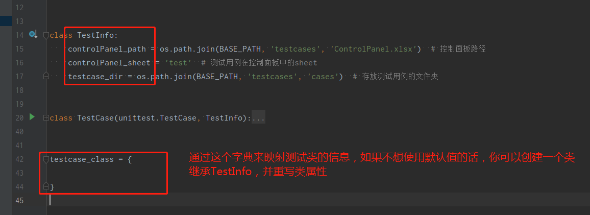

# 项目简介

这是一个简易的web自动化测试框架。基于selenium和unittest开发，使用page object的设计模式，以关键字驱动用例执行。

这里的关键字是相对大粒度的操作，而非Robot Framework那样小粒度的关键字，这样做是为了使组装的测试流程更加简洁。

# 项目结构

# 项目使用

1、把适合你浏览器的驱动放在drivers文件夹下，并修改配置文件

2、在pages文件夹下新建py文件，继承BasePage类，你可以使用self.driver来调用二次封装的selenium操作，然后通过@keyword()来自定义关键字。

BasePage中提供了几个基础的关键字，你可以自己扩展它。

BasePage类的关键字应该是对selenium提供的操作浏览器方法的封装，自定义Page类中的关键字，应当面向业务，是对一个独立业务操作的封装，比如登录操作，创建表单操作等，在保证测试用例里测试流程简洁的同时，提供关键字的复用性。

3、有了足够支撑用例流程的关键字之后，你可以使用它们来拼装你的测试用例

在testcases文件夹下的cases文件夹里，你可以新增用例文件，也可以新建不同的文件夹来存放用例文件。

 

 

拼装好的测试用例要放在ControlPanel中来控制它

4、现在你可以在main.py中来执行它并生成报告，或者在local_execute.py中来调试单个用例看看效果。

# 效果展示

# 注意

1、你会在pages文件夹下创建不同的文件来对应不同的page，你可以再新增文件夹或者直接创建文件，但自定义关键字的文件一个要以_page.py结尾，否则无法自动注册关键字。

 

2、框架操作excel文件使用的是openpyxl，所以文件格式一定要是openpyxl支持的格式，推荐.xlsx，.xls格式是不被支持的。

3、main.py中要填的测试类信息，目前是在frame/core/testcase.py里的，这样不太合适，后续会抽离出来。

4、为报告添加截图使用的是BasePage里的screenshot_to_report方法，你可以在自定义关键字时调用此方法来为你想要人工确认的地方留下截图。

